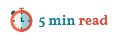

<p align="center">
    
</p>
<p align="center">
    A Svelte component to display an estimated reading time
</p>

---

[](https://www.npmjs.com/package/@untemps/svelte-readotron)
[](https://github.com/untemps/svelte-readotron/actions)
[](https://codecov.io/gh/untemps/svelte-readotron)

## Installation

```bash
yarn add @untemps/svelte-readotron
```

## Usage

### Basic usage

```html
<script>
    import Readotron from '@untemps/svelte-readotron'
</script>

<main>
    <Readotron selector=".text"/>
    <section class="text"/>
</main>
```

`selector` prop is mandatory as it should contain the text content to parse.  
You can use all selectors supported by the Web API [querySelector](https://developer.mozilla.org/fr/docs/Web/API/Document/querySelector) function.  
If several elements match the selector, the first one is used.

### Lang

The component uses the @untemps/ReadingTimer underhand package which returns an estimation based on the lang.  
Reading rates by lang come from ["How many words do we read per minute? A review and meta-analysis of reading rate"](https://osf.io/4nv9f/) by  Marc Brysbaert - Department of Experimental Psychology Ghent University

| Lang      | Rate  |
| --------- | ------|
| default   | 200   |
| ar        | 181   |
| zh        | 260   |
| nl        | 228   |
| en        | 236   | 
| fi        | 195   |
| fr        | 214   |
| de        | 260   |
| he        | 224   |
| it        | 285   |
| ko        | 226   |
| es        | 278   |
| sv        | 218   |

If the lang is not one of the listed ones or is undefined, the default value will be used.

#### Example

```html
<script>
    import Readotron from '@untemps/svelte-readotron'
</script>

<main>
    <Readotron selector=".text" lang="en"/>
    <section class="text"/>
</main>
```

### Template

You can customize the Readotron display by using the `template` prop.  
A template is a string with one or more tokens delimited with `%`

#### Avalaible tokens

| Token         | Description                                                                                                      |
| ------------- | ---------------------------------------------------------------------------------------------------------------- |
| `time`        | Estimated reading time (in minutes)                                                                              |

#### Example

```html
<script>
    import Readotron from '@untemps/svelte-readotron'
</script>

<main>
    <Readotron selector=".text" template="Reading Time: %time% minutes"/>
    <section class="text"/>
</main>
```

### Slot

Another way to customize the display is to use the `<slot>` element.  
If a `<slot>` is passed in as Readotron child and correctly set (see Constraints below), it will be rendered instead of the default layout. This has precedence over the `template` prop.  
This allows to set a specific tag as parent if needed.

#### Constraints: 
The `<slot>` element has to be set with the prop `slot="content"`

#### Avalaible tokens

Like `template`, tokens are passed back to the component to display dynamic values (see [Svelte API documentation](https://svelte.dev/docs#slot_let)):

| Token         | Description                                                                                                      |
| ------------- | ---------------------------------------------------------------------------------------------------------------- |
| `time`        | Estimated reading time (in minutes)                                                                              |

#### Example

```html
<script>
    import Readotron from '@untemps/svelte-readotron'
</script>

<main>
    <Readotron selector=".text">
        <span slot="content" let:time>{time} min</span>
    </Readotron>
    <section class="text"/>
</main>
```

Please see the [Svelte API documentation](https://svelte.dev/docs#slot) to know more about the `<slot>` element.

### Styles

All HTML attributes are automatically passed to the parent element of the component (`span`).  
That means you can use the `class` attribute to customize the style of the component.

#### Example

```html
<script>
    import Readotron from '@untemps/svelte-readotron'
</script>

<main>
    <Readotron selector=".text" class="readotron"/>
    <section class="text"/>
</main>

<style>
    .readotron {
        color: #0075ff;
        font-weight: 600;
    }
</style>
```

If you use a `<slot>` element, as it will replace the original layout, you have to switch the class name from the `<Readotron>` element to the `<slot>` element.

```html
<script>
    import Readotron from '@untemps/svelte-readotron'
</script>

<main>
    <Readotron selector=".text">
        <span class="readotron" slot="content" let:time={time}>{time} min</span>
    </Readotron>
    <section class="text"/>
</main>
```

### API

| Props         | Type              | Default              | Description                                                                                                                                                       |
| ------------- | ----------------- | -------------------- | ----------------------------------------------------------------------------------------------------------------------------------------------------------------- |
| selector      | string            | (required)           | Selector of the element which contains the content to parse. See [document.querySelector](https://developer.mozilla.org/fr/docs/Web/API/Document/querySelector)   |
| lang          | string            | 'en'                 | Lang of the content [""ar', 'zh', 'nl', 'en', 'fi', 'fr', 'de', 'he', 'it', 'ko', 'es', 'sv']                                                                     |
| template      | string            | '%time% min read'    | Display template which contains dynamic token to be replaced by the parsed values                                                                                 |

## Roadmap

- Add slot testing and missing unit tests